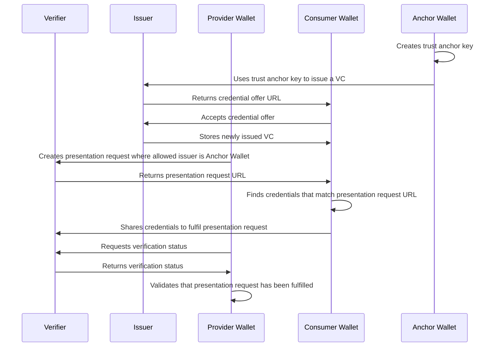

# Self-Sovereign Identity PoC

A minimal proof-of-concept of how to leverage Verifiable Credentials (VC) and Decentralized Identifiers (DID) to implement identity and trust in a data space.

> [!NOTE]  
> Built on top of [walt.id](https://docs.oss.walt.id/), which provides comprehensive APIs for deployment of _Wallets_, _Issuers_, and _Verifiers_.

