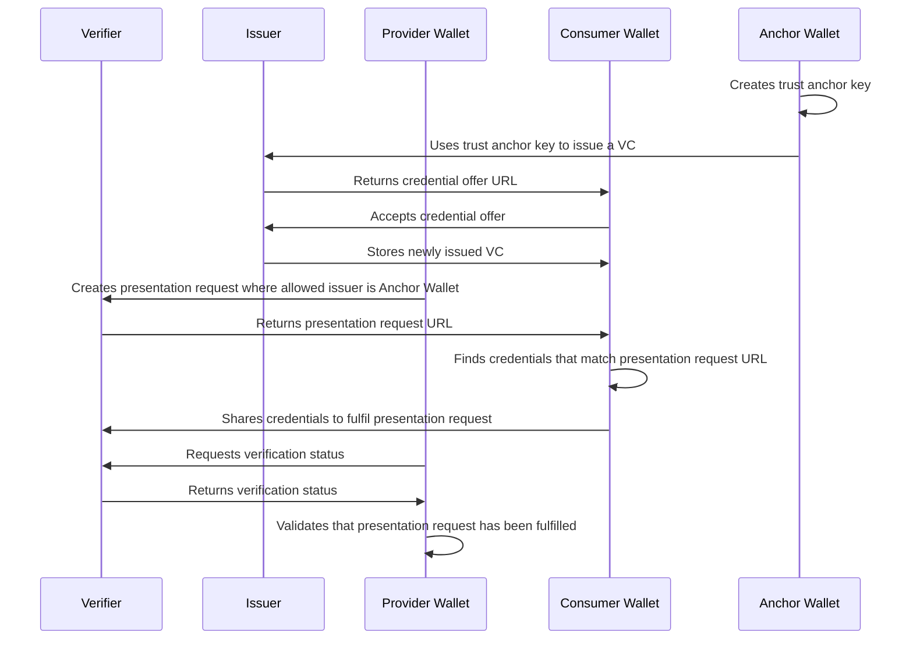

# Self-Sovereign Identity PoC

A minimal proof-of-concept of how to leverage Verifiable Credentials (VC) and Decentralized Identifiers (DID) to implement identity and trust in a data space.

> [!NOTE]  
> Built on top of [walt.id](https://docs.oss.walt.id/), which provides services to deploy _Wallets_, _Issuers_, and _Verifiers_.

The Compose stack is configured with three different instances of wallets, an issuer, and a verifier.
The wallets represent two participants—consumer and provider—and a trust anchor that acts as one of the authorities of the data space. The issuer and verifier are centralised services that have key roles in the implementation of OpenID4VP and OpenID4VC flows.

The script in this repository illustrates the interactions between the wallets, issuer and verifier to issue a VC, request the presentation of the VC, and fulfil that presentation request. Moreover, only VCs issued with the key of the trust anchor are accepted as valid credentials.

